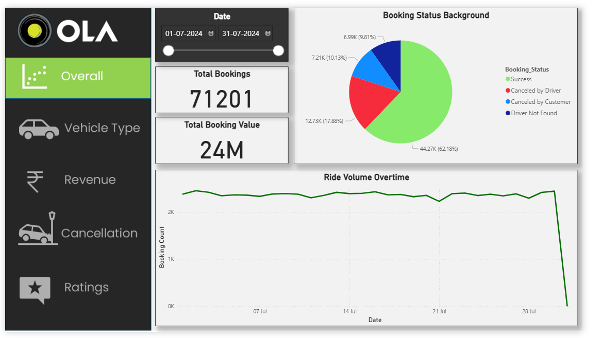

# 🚕 Ride Booking Analysis – July 2024

This Power BI project explores and visualizes ride booking data for the month of July 2024. The analysis provides valuable insights into booking trends, customer behavior, cancellation rates, and peak operational hours.

---

## 📊 Project Objective

To build an interactive Power BI dashboard that identifies patterns and performance indicators in ride booking data. This analysis can help optimize operations, reduce cancellations, and improve customer experience.

---

## 📁 Files Included

| File | Description |
|------|-------------|
| `Bookings.pbix` | Power BI dashboard with all data visualizations |
| `Bookings.xlsx` | Original booking data for July 2024 |
| `Images/` | Screenshots of the dashboard |
| `SQL/kpi_queries.sql` | SQL logic behind the calculated KPIs |
| `Docs/Data_Dictionary.md` | Explanation of each column and metric (optional) |

---

## 🔍 Key Insights

- 📅 **Peak Booking Days:** Highest number of bookings occurred on weekends, especially Fridays and Saturdays.
- ⏰ **Popular Time Slots:** Most bookings were made between 10 AM to 2 PM.
- 📍 **Top Locations:** Location X and Y had the most frequent bookings.
- ❌ **Cancellations:** 12% of total bookings were cancelled, with the majority occurring during peak hours.
- 📈 **Growth Opportunity:** Loyalty users book more frequently and cancel less often—suggesting a focus area for marketing.

---

## 🛠 Tools & Tech Used

- **Power BI** – Interactive dashboard development
- **Excel** – Data cleaning and transformation
- **DAX** – Measures and KPIs
- **SQL** – Data analysis

---

## 📆 Time Intelligence

A separate Date Table was created to allow dynamic slicing by:
- Year
- Quarter
- Month
- Day

This enables time-based comparisons and cumulative metrics.

---

## 📌 How to Use

1. Clone or download this repo.
2. Open `Bookings.pbix` in Power BI Desktop.
3. Use slicers to filter data by:
   - Booking Status
   - Location
   - Date
   - Time slot

---

## 🤝 Contributions

Feel free to fork the project and enhance it with:
- Forecasting models
- Maps for geolocation insights
- Integration with real-time data via API

---

## 🔗 Connect with Me

Made with 💛 by [Your Name]  
📧 Email: vazbrinceton@email.com  
🔗 LinkedIn: www.linkedin.com/in/brincetonvaz
🔗 GitHub: https://github.com/brincyyyy

---

